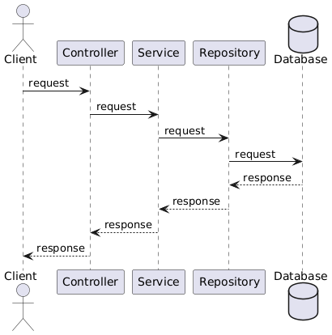
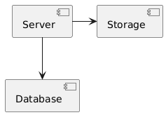
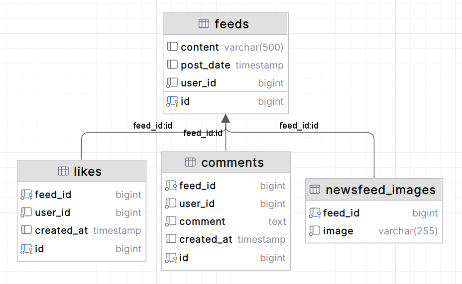

Запуск , приложение работает на 8080 порту
1. Скачать запустить докер - компоуз файл

http://localhost:8081/swagger-ui/index.html -свагер
Server картинок на 9000 порту, чтобы получить картинку нужно с бд поставить путь к порту 9000 http://localhost:9000/newsfeed/77daa725-0aae-40e3-ab03-4670a0e3f00b.jpg

//Bugs:
1. Solved: Если ложить приложение в докер не находит енв файл и как следствие не запускаеться.ПРоблема модульности проекта. (нужно в енв указывать имя докер контейнера)
## Sequence diagram

## Component diagram

Main application communicates with c database (Postgresql), storage (MinIO).

## Class diagram

Main classes - **Feed** .